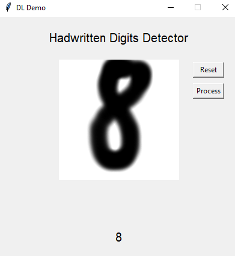
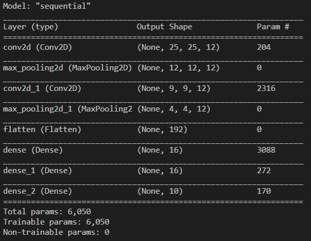

# Deeplearning in a nutshell

## General introduction
This project is diffrent from the other projects on my Account.  
The main focus is not on the programming related stuff, but on the deep learning related theory.  

This Project was, like many of my project, made for school. To be spesific to POS logik. It's not a important fact, but i feel like i need to tell it. 
 
I didn't do all of the work myself. This Project was made in cooperation with two friends @LuckForce @Marko.

## What is this Project really about.

Like already told is the main focus on the Deep Learning theory. The explanation part is done in 
google docs, not here.  
The reason for that is, if someting is changed, everyone with the link has the update right away. It make things a lot easier, in the aspect of the cooperation with my teammembers. If you don't want to rely on the link, you can also simply download it as any file format you like:) 

You can view the document here:
https://docs.google.com/document/d/1VaagX4wZUiy-Vo_qol5mipthvHf0_rwtcMO2qcA_nUs/edit?usp=sharing

The hole document is unfortunately written in german:(

You are propably wondering, if everything is on the google docs, for what is this Repository then?

The answer is simple. In the explanation, is a part, where the concepts are shown in action. In an Example. In this repository is this example.

## What is the example like?

The example is a simple CNN, which is trained to recognize the digits 0-9. 
I know it has been seen multiple times, but we needed a simple example, because the google docs document was so much work.
We used the classic MNist dataset.

In the example you can draw digits and see the result. The predictions aren't always accurate, but very often.  
By the way, if you try to draw a 7 don't draw the line through the middle. In the Dataset it is not drawn like that.

How you can guess, the we used supervised learning and a CNN. You can see the structure of the NN in the image above.

We know, that a smaller network would work to, but for educational resosons, we used a bigger network.

## Installation
There is a release with a zip file. In the Zip file is the source code and the Python virtual envioment.

Python 1.9 has to be installed

### Windows
Run the 00Start.ps1 powershell script.

### Any other platform
Start the python virtual environment.
And run the GUI.py File from the MINST directory.

You can't simply clone the repo, because the env is not uploaded there completely.

## What did we learn?

We learned a lot of things. My teammates had nothing done with AI in the past. So all the theory was new for them.  

For me most things weren't new. But i still deepend my understanding of the gradient descent algorithm and backpropagation and many other topics.

## Who did the what?

- Maximilian Fischer(me): The example project and most of the document.
 
- Adrian Schauer: In the document, the paragraph about backpropagation
 
- Marko: In the document, the paragraph about AI in our Society.

## Tools used in the Project?
- Tkinter
- Tensorflow
- MNist Dataset
- google :)
- python
- Google Docs
  
A detailed list of the sources for the google docs, can be found in the document
